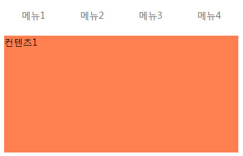

# ktec_es6_guide

- 지원

>browse( chrome )  
>File encoding: UTF-8  

## 목차

-   ch01

    이미지소스 : ch01/images/    
    설명 : 소스를 활용하여 아래처럼 구현해보자
    
    
      
    
-   ch02
    이미지소스 : ch02/images/    
    설명 : 텝메뉴를 클릭할때 하단 컨텐츠 영역을 바꿔보자
    
    
      
